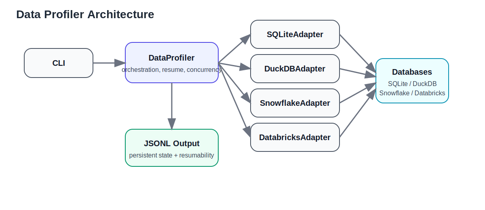

# Data Profiler


A scalable, extensible data profiling system for modern data platforms.

---

## 🚀 Overview

Data profiling is a critical step in understanding datasets, validating data quality, and enabling downstream analytics. However, profiling large schemas across heterogeneous systems is often slow, inconsistent, and hard to scale.

This project implements a **multi-database data profiler** with a focus on:

- Performance (sampling, pushdown computation)
- Extensibility (adapter-based architecture)
- Resilience (resumable execution)
- Portability (engine-agnostic profiling model)

---

## 🧩 Problem

Traditional profiling approaches:
- scan entire datasets (slow)
- lack standardization across databases
- don’t scale to large schemas
- fail mid-run without recovery

---

## 💡 Solution

This system provides:

- 🔌 **Adapter-based architecture** for multiple databases
- ⚡ **Sampling + predicate pushdown** for performance
- 🧵 **Parallel execution** across tables
- ♻️ **Resumable runs** using JSONL persistence
- 📊 **Column-level statistics + histograms**
- 🧱 **Portable schema abstraction**

---

## 🏗️ Architecture



```
CLI
 │
 ▼
DataProfiler
 │
 ├── SQLiteAdapter
 ├── DuckDBAdapter
 ├── SnowflakeAdapter
 └── DatabricksAdapter
 │
 ▼
Database
 │
 ▼
JSONL Output (persistent state)
```

---

## ⚙️ Features

### Performance
- Sampling for large tables
- SQL pushdown (aggregation in DB)
- Parallel table profiling

### Configurability
- Sample size control
- Histogram enable/disable
- Concurrency (max workers)

### Resilience
- Incremental persistence (JSONL)
- Resume incomplete runs

### Output
- Structured JSONL output
- Portable across systems

---

## 🧪 Supported Engines

| Engine       | Status       |
|--------------|-------------|
| SQLite       | ✅ Fully supported |
| DuckDB       | ✅ Fully supported |
| Snowflake    | ⚙️ Implemented (requires connector + credentials) |
| Databricks   | ⚙️ Implemented (requires connector + credentials) |

---

## 📦 Installation

### Core dependencies

```bash
pip install -r requirements.txt
```

### Optional (Warehouse support)

```bash
pip install -r requirements-warehouse.txt
```

> Note:
> - Snowflake may require Python 3.12/3.13 on Windows
> - Databricks requires access token + SQL warehouse

---

## ▶️ Usage

### SQLite

```bash
python -m src.data_profiler.cli \
  --engine sqlite \
  --sqlite-path sample.db
```

### DuckDB

```bash
python -m src.data_profiler.cli \
  --engine duckdb \
  --duckdb-path sample.duckdb \
  --include-histograms
```

### Snowflake

```bash
python -m src.data_profiler.cli --engine snowflake
```

Environment variables:

```bash
SF_USER=...
SF_PASSWORD=...
SF_ACCOUNT=...
SF_WAREHOUSE=...
SF_DATABASE=...
SF_SCHEMA=...
```

### Databricks SQL Warehouse

```bash
python -m src.data_profiler.cli --engine databricks
```

Environment variables:

```bash
DBX_SERVER_HOSTNAME=...
DBX_HTTP_PATH=...
DBX_ACCESS_TOKEN=...
DBX_CATALOG=...
DBX_SCHEMA=...
```

---

## 📊 Sample Output

```json
{
  "table": "users",
  "row_count": 1000,
  "columns": [
    {
      "name": "age",
      "min_value": 25,
      "max_value": 40,
      "distinct_count_estimate": 10,
      "null_count": 2
    }
  ]
}
```

---

## 🧪 Running Tests

```bash
#To execute the whole test suite
pytest
#To execute individual TCs
pytest tests/test_duckdb_behaviors.py 
```

---

## 🧠 Design Decisions

### Adapter Pattern
Decouples core profiling logic from database-specific implementations.

### Sampling over Full Scan
Trades accuracy for performance on large datasets.

### JSONL Persistence
- Append-only
- Easy resume
- Stream-friendly

### Parallelism
- Table-level concurrency
- Avoids shared DB connection issues (especially DuckDB)

---

## ⚖️ Tradeoffs

| Decision | Tradeoff |
|----------|----------|
| Sampling | Faster but approximate |
| JSONL vs DB | Simpler but less queryable |
| Parallelism | Faster but needs thread-safe adapters |

---

## 🚀 Future Improvements

- Approximate quantiles (e.g., t-digest)
- Cost-based profiling (adaptive sampling)
- UI / visualization layer
- Column-level lineage integration
- Streaming dataset support

---

## 📌 Notes

- Snowflake and Databricks adapters are tested using mocks
- Warehouse connectors are optional to avoid local setup issues
- Designed with production scalability in mind

---

